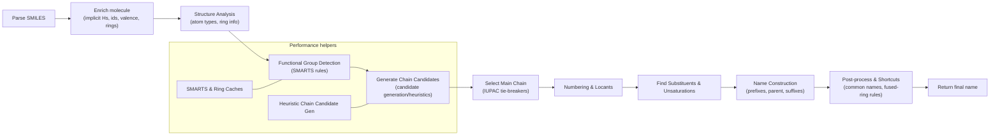

# SMILES → IUPAC Name Generation (User Overview)

A concise, non-verbose explanation of how openchem converts a SMILES string into an IUPAC name. This is intended to give readers a clear mental model rather than an exhaustive API reference.

**Related Documentation:**
- **[IUPAC Documentation Hub](iupac-readme.md)** — Central navigation for all IUPAC docs
- **[Implementation Guide](iupac-implementation.md)** — Technical architecture and algorithms
- **[Capabilities & Limitations](iupac-capabilities.md)** — What works, what doesn't, roadmap
- **[Rules Reference](iupac-rules-reference.md)** — Detailed IUPAC Blue Book rule coverage



## Quick step summary

- Parse SMILES
  - Convert SMILES into a Molecule object (atoms, bonds, basic properties). Typical entry points: `parseSMILES(...)` followed by `generateIUPACName(molecule)`.

- Enrich molecule
  - Add implicit hydrogens, compute atom/bond ids and valence, and detect rings. The enriched molecule is used by SMARTS matching and analysis.

- Structure analysis
  - Derive atom properties (aromatic, degree), ring membership, and other helpers used by naming heuristics.

- Functional-group detection
  - Run SMARTS-based rules to locate principal functional groups and substituents. These detections influence parent selection and suffix choice.

- Chain candidate generation
  - Produce plausible parent chains (carbon-only and heavy-atom candidates). For performance, candidate generation uses heuristics rather than brute-force enumeration for very large molecules.

- Main-chain selection and tie-breakers
  - Apply IUPAC-style priorities: principal functional group precedence, lowest set of locants (unsaturation, heteroatoms, substituents), and OPSIN-like tie-breaks to select the best candidate.

- Numbering & locants
  - Number the chosen parent chain to compute positions (locants) for substituents and unsaturations.

- Substituent & unsaturation handling
  - Detect and classify substituents, collect positions, and compute multiplicative prefixes (di/tri/bis, etc.).

- Name construction
  - Assemble prefixes, parent stem, unsaturation suffixes (`-ene`, `-yne`), and functional-group suffix (e.g., `-ol`, `-oic acid`) using the name constructor and pipeline.

- Post-processing and special cases
  - Apply fused-ring shortcuts, common-name replacements, and fallback formulas. When the standard pipeline cannot produce a suitable name, SMARTS-driven special-case names or formula-based fallbacks may be used.

## Example usage (API sketch)

```ts
import { parseSMILES, generateIUPACName } from 'index';

const parsed = parseSMILES('CC(=O)Oc1ccccc1C(=O)O');
const mol = parsed.molecules[0];
const iupac = generateIUPACName(mol);
console.log(iupac);
```

## Performance notes (short)

- SMARTS matching and chain enumeration are the main hotspots.
- The system uses caching (where present) and heuristics to reduce repeated SMARTS and ring computations for the same molecule.
- For very large molecules, heuristic chain candidate generation is used to avoid combinatorial explosion.

## Where to Look for More Detail

### User Documentation
- **[Capabilities & Limitations](iupac-capabilities.md)** — What the engine can name (93.5% accuracy on 127 molecules)
- **[Large Molecules Analysis](iupac-large-molecules.md)** — Strategic limitations for complex natural products

### Developer Documentation
- **[Implementation Guide](iupac-implementation.md)** — Architecture overview, layered pipeline, state management
- **[Rules Reference](iupac-rules-reference.md)** — IUPAC Blue Book rules (P-14, P-44, P-51, etc.)

### Source Code (Key Files)
- **High-level entry point:** `src/iupac-engine/iupac-name-generator.ts`
- **Rule layers:** `src/iupac-engine/rules/` (8 layers: atomic, functional-groups, parent-chain-selection, numbering, name-assembly, etc.)
- **Naming logic:** `src/iupac-engine/naming/` (substituent-namer, functional-class-namer, locants)
- **OPSIN data integration:** `src/iupac-engine/opsin-functional-group-detector.ts`, `opsin-iupac-data/LOOKUP.json`

## Contributing / Extending (Brief)

For detailed instructions on extending the engine, see **[Implementation Guide: Extending the Engine](iupac-implementation.md#extending-the-engine)**.

**Quick Tips:**
- Add new functional-group SMARTS to the rule engine to support more suffixes. Prefer cheap pre-filters or caching for expensive SMARTS.
- For large-molecule performance improvements, focus on memoizing per-molecule results and limiting chain candidates.
- Add unit and performance tests when changing candidate generation or SMARTS rule sets.

**Current Priorities (from [Capabilities Roadmap](iupac-capabilities.md#roadmap)):**
1. **High Priority:** Saturated heterocycles (morpholine, piperazine), tertiary amides
2. **Medium Priority:** Sulfoxides/sulfones, locant optimization
3. **Low Priority:** Trivial name preferences, natural product extensions

---

**Note:** This document is intentionally concise for end users. For detailed developer documentation, see:
- **[Implementation Guide](iupac-implementation.md)** — Architecture, algorithms, state management
- **[Rules Reference](iupac-rules-reference.md)** — Detailed IUPAC rule coverage
